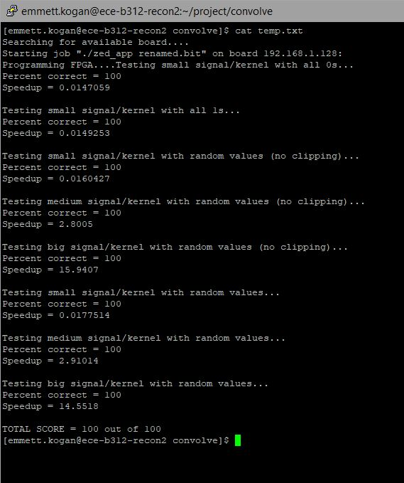
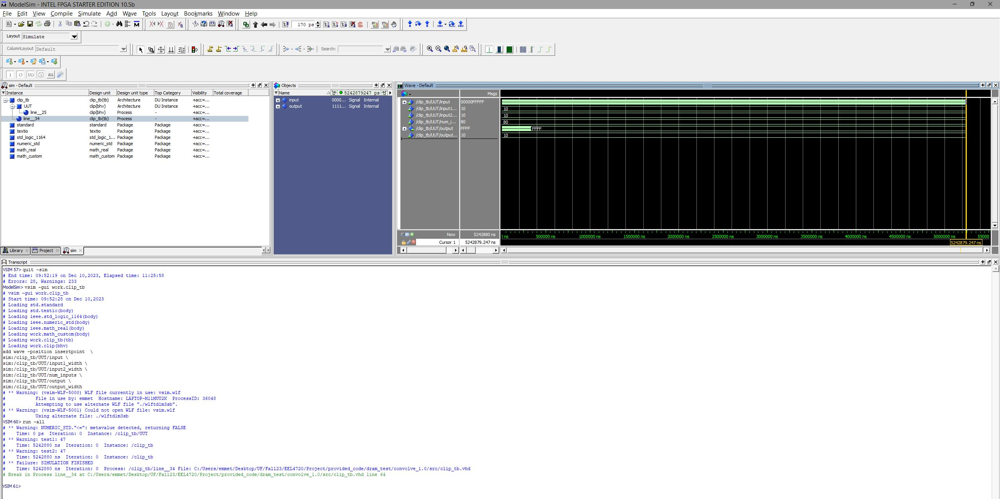

# Group Members:
1. John Baldwin
2. Emmett Kogan

# Report:

## Convolve/userapp
For convolve, while using the given DMA read setup from DRAM test, the convolve userapp got 100s on the given SW test as shown below:

The clipping entity was verified with an exhaustive test bench:

The smart buffer took the most amount of time for me, funnily more than the userapp because I had a ton of timing issues. I had a modified version of wrapper_tb.vhd I was using to help look at signals but I can't find it anymore. Instead I have a screenshot of the original wrapper_tb.vhd

## DMA read