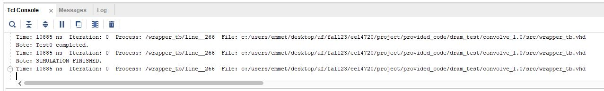
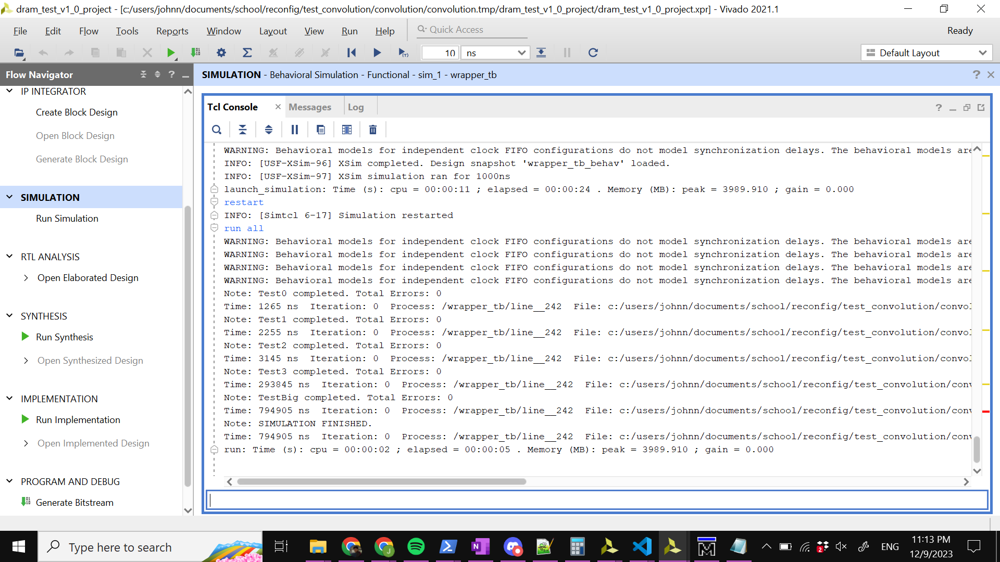
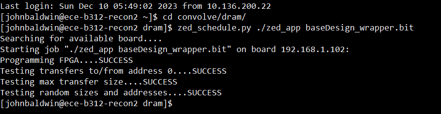
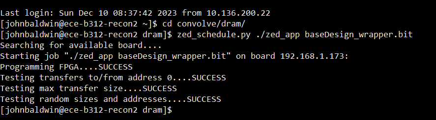

# Group Members:
1. John Baldwin
2. Emmett Kogan

# Report:

## Convolve/userapp
### Emmett Kogan

For convolve, while using the given DMA read setup from DRAM test, the convolve userapp got 100s on the given SW test as shown below:

Here is part of the output of the userapp passing the timing constraints of the simulation, which was then used to fix various parts of the userapp relating to the actual data (smart buffers):

The clipping entity was verified with an exhaustive test bench:

I made basic test benches for the entities that I made (so clip and smart_buffer). I spent a lot of time testing smart buffer to make sure that it was actually shifting in values how I wanted it to, and behaving correctly with the reverse generic I used to avoid having to deal with another external entity floating between the smart buffers and the pipeline inputs if I wanted to reverse one, which was relativley simple to implement. When I originally did it, I was using the window type that was provided in user_pkg, but, I was having timing issues with it so at some point I just converted it into a std_logic_vector that was window_size * word_size wide, and did stv slicing to move things and concatentation to insert the new data. This also prevented me from actually having to make a vectorize entity or invoke the code that was in the pipeline (I think) that was dealing with converting std_logic_vectors to windows as windows kind of just became a pain to work with at some point (especially when I was testing various stages of entities at the same time to see if I was actually making a difference in the timing issues). At some point, I had a smart_buffer_tb that just compared one that I knew didn't work but asserted done correctly to the one I was working on to make sure those signals were correct because I knew that the actual shift register would be much easier to just eyeball.

Clip was relativley simple as it was just combinational logic with a comparison to the max clipped value, and the test bench I wrote was a lazy way to make sure all of the different values were represented and that the clipping part was actually exercised.

Beyond these test benches I played with and used the given wrapper_tb to look at internal signals when simulating in vivado (most of the other ones I wrote were just for modelsim to build confidence on the depending entities first), and making slight adjustments to the user_app as I traced through signals to debug. And a lot of looking at this test bench was just noticing patterns, recreating them in a modelsim testbench of the entity at fault and then trying to correct it from there.

The smart buffer took the most amount of time for me, funnily more than the userapp because I had a ton of timing issues. I had a modified version of wrapper_tb.vhd I was using to help look at signals but I can't find it anymore. Instead I have a screenshot of the original wrapper_tb.vhd. These were discussed earlier for how I essentially brute force solved these issues.

The actual implementation is relativley simple and based off the lectures as much as possible, with the only main deviation being that I just used stv's for the smart buffer because it became easier than dealing with windows since it only really affected 1 or 2 lines of code.

## DRAM_RD
### John Baldwin

While working on the DRAM_RD I encountered 2 primary VHDL errors and many many errors due to Vivado oddities. My first major VHDL error stemmed from a combination of the Address Generator and combinational logic used for the reading of the FIFO. In this situation the FIFO was only reading 9978 out of 10000 values in the 3rd test. This was ultimately caused by the dram_rd_en signal going low before the last address was able to get out. By making my address generator a 2 process state machine and adding some additional combinational logic around the state machine I was able to fix this error. Part of what helped me fix this error was the following block of non-synthesizable test bench code that I embedded within the DRAM_RD architecture to allow me to see what values were being skipped during reads. 

    data <= fifo_data_out;
    process(user_clk)
    begin
	    if (rising_edge(user_clk)) then
		    if (unsigned(fifo_data_out) /= 0) then
			    assert (unsigned(fifo_data_out) = unsigned(fifo_data_out_prev) + 1) report  "FIFO read error"  severity  warning;
			    fifo_data_out_prev <= fifo_data_out;
		    elsif (done_and_rst = '1') then
			    fifo_data_out_prev <= (others => '0');
		    end  if;
	    end  if;
    end  process;

My second major issue arose from the counter and address generator being out of sync. This caused a done not asserted error and was ultimately fixed by making the assignment of address valid to be asynchronous and adjusting the start conditions for the counter. The combination of these two things fixed my timing issues and allowed me to move on to adding in timing constraints on the device. To help verify that my counter and address generator were working I wrote a short testbench that allowed me to visualize the signals and test specific properties where desired. 

Successful DRAM_RD testbench execution:

Successful DRAM_RD board run without timing constraints:

Successful DRAM_RD board run with timing constraints:

